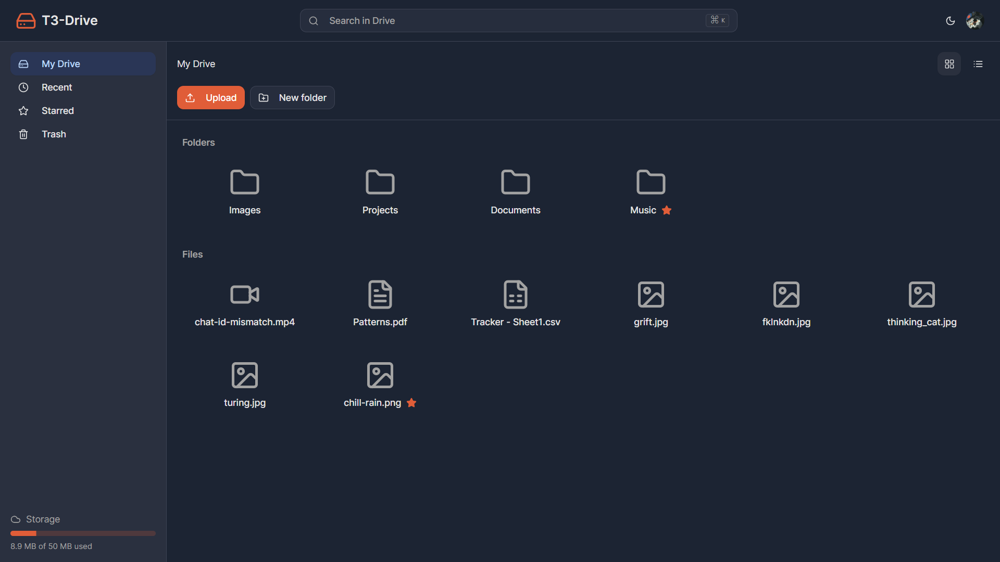
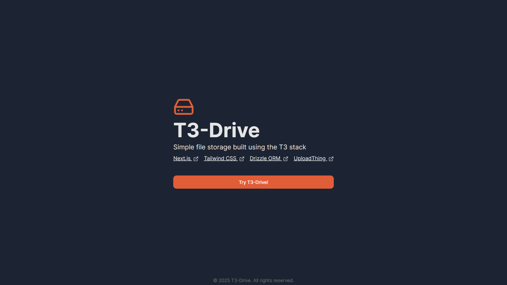
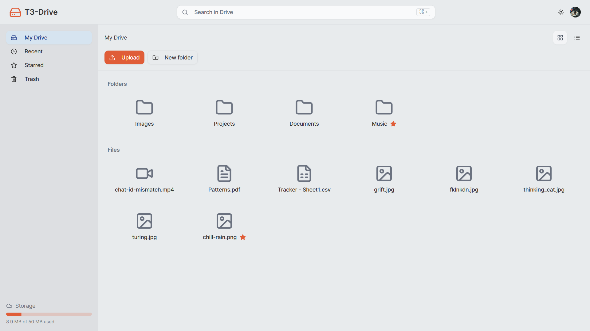
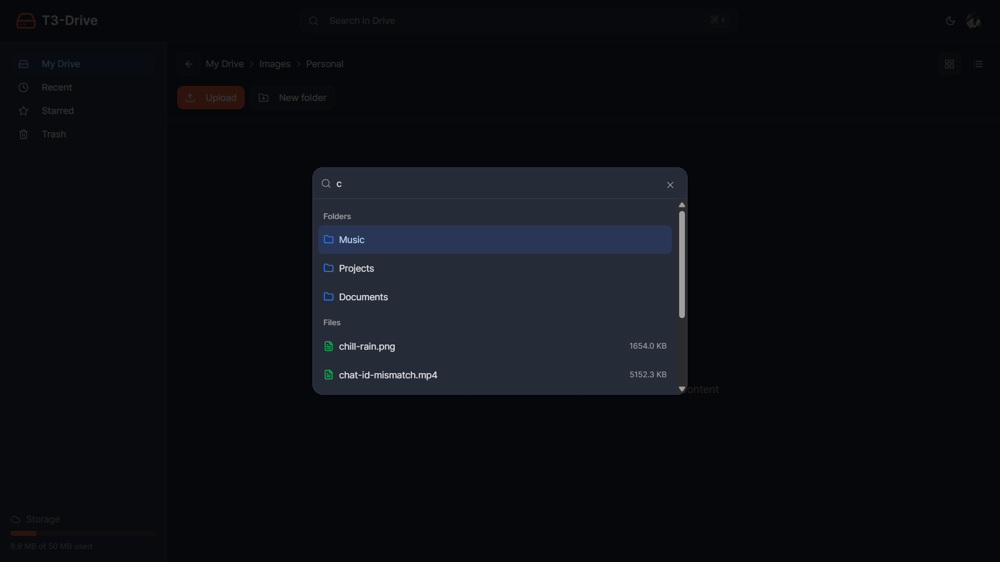
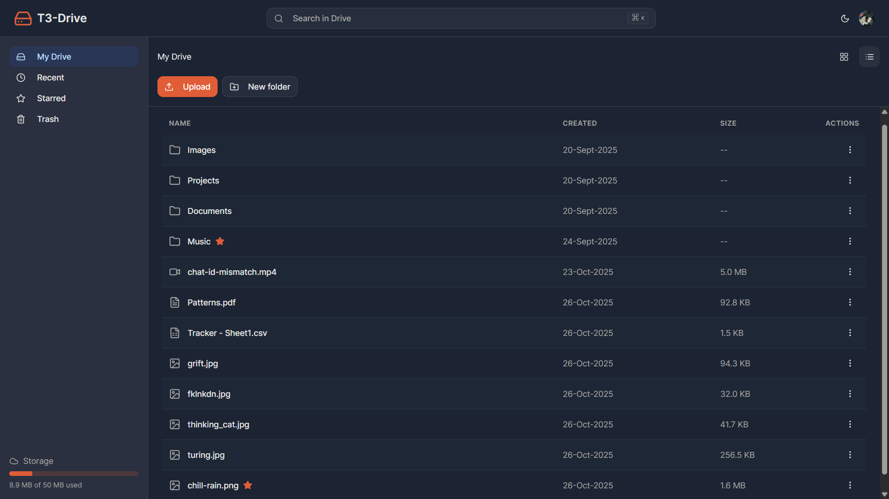
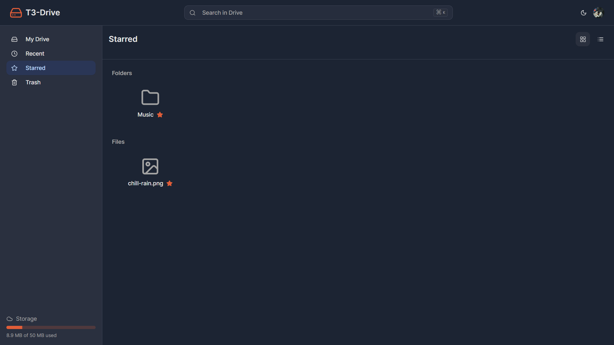
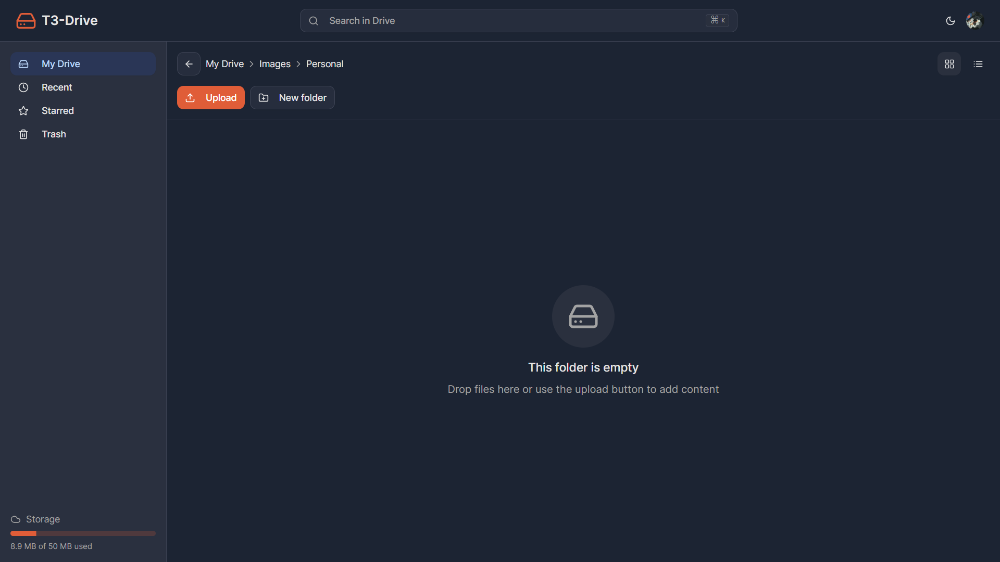

<div align="center">

# [📁 T3-Drive](https://t3-drive.vercel.app)

A modern, full-featured file management system built with the T3 Stack.



**Try it here** 👉 [t3-drive.vercel.app](https://t3-drive.vercel.app)

</div>

## ✨ Features

- **Secure Authentication**: Clerk-based user authentication with seamless sign-in/sign-out
- **Hierarchical File Management**: Create nested folders and organize files in a tree structure
- **Multiple File Upload**: Upload multiple files simultaneously with drag & drop support
- **Global Search**: Real-time search with keyboard shortcut (⌘K/Ctrl+K) across all files and folders
- **Starred Items**: Mark important files and folders as favorites for quick access
- **Trash System**: Move items to trash and restore them, with permanent deletion option
- **Responsive Design**: Optimized layouts for desktop and mobile devices
- **Dark/Light Theme**: Toggle between themes with persistent preferences
- **Storage Management**: Real-time storage usage tracking with 50MB limit
- **Recent Files**: Quick access to recently created files and folders
- **Grid/List Views**: Toggle between grid and list display modes with persistent settings
- **Fast Navigation**: Breadcrumb navigation and keyboard shortcuts for efficient browsing
- **File Type Recognition**: Smart icons for different file types (PDF, images, documents, code, etc.)
- **Context Menus**: Right-click menus for quick file and folder operations
- **File Renaming**: Rename files and folders with validation
- **Upload Progress**: Visual progress indicators during file uploads

<details>
<summary><h2>🖼️ Screenshots</h2></summary>

### Landing Page



### Light Theme Preview



### Global Search Interface



### List View Mode



### Starred Items View



### Empty Folder State



</details>

## 🧰 Tech Stack

- Next.js 15
- React 19
- TypeScript
- Tailwind CSS v4
- Shadcn UI
- Tanstack Query
- Clerk Authentication
- Drizzle ORM
- SingleStore Database
- UploadThing
- Vercel AI SDK
- Lucide React Icons

## 💻 Getting Started

1. Clone the repository
2. Install dependencies:
   ```bash
   pnpm install
   ```
3. Set up your environment variables:

   ```env
   DATABASE_URL=your_singlestore_url
   SINGLESTORE_USER=your_username
   SINGLESTORE_PASS=your_password
   SINGLESTORE_HOST=your_host
   SINGLESTORE_PORT=your_port
   SINGLESTORE_DB_NAME=your_database

   NEXT_PUBLIC_CLERK_PUBLISHABLE_KEY=your_clerk_key
   CLERK_SECRET_KEY=your_clerk_secret

   UPLOADTHING_SECRET=your_uploadthing_secret
   UPLOADTHING_APP_ID=your_uploadthing_app_id
   ```

4. Set up the database:
   ```bash
   pnpm db:push
   ```
5. Run the development server:
   ```bash
   pnpm dev
   ```
6. Open [http://localhost:3000](http://localhost:3000) in your browser

## 🛠️ Development

- Built with Next.js App Router
- Uses Turbopack for faster development
- TypeScript for type safety
- ESLint and Prettier for code quality
- Tailwind CSS for styling
- SingleStore database with Drizzle ORM
- UploadThing for file storage
- Clerk for authentication

## 📜 License

MIT

## 💙 Acknowledgements

- [Theo](https://www.youtube.com/@t3dotgg) for the amazing [tutorial](https://www.youtube.com/watch?v=c-hKSbzooAg)
- [T3 Stack](https://create.t3.gg/) for the amazing development experience
- [Clerk](https://clerk.com/) for seamless authentication
- [UploadThing](https://uploadthing.com/) for reliable file storage
- [SingleStore](https://www.singlestore.com/) for the database
- [Vercel](https://vercel.com/) for deployment
- [Shadcn UI](https://ui.shadcn.com/) for accessible components
- [Tailwind CSS](https://tailwindcss.com/) for styling
- [Drizzle ORM](https://orm.drizzle.team/) for database operations

<div align="center">

<strong>⭐ Leave a star maybe? ⭐</strong>

<a href="https://github.com/buneeIsSlo/t3-drive">Source</a>
| <a href="https://twitter.com/awwbhi2" target="_blank">X/Twitter</a>
| <a href="https://github.com/buneeIsSlo" target="_blank">GitHub</a>

</div>
